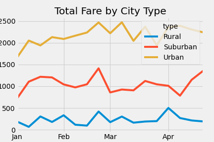

# PyBer_Analysis
Python/Matplotlib/Data Visualization Project

## Overview:
The purpose of this project was to analyze PyBer's weekly ride-share fare prices by city type (rural, urban, and suburban) to highlight how the data differs by city type and how those differences can be used by decision-makers at PyBer. 
 

I used the Pandas library to create a summary DataFrame by re-formating and combining two given data sets. Then using Matplotlib I created multiple graphs to help visualize the differences in total weekly fares for each city type.

## Results:
Unsurprisingly, we can see from our analysis that urban city types account for a much larger proportion of fares compared to suburban and rural. In fact, we can see from the pie chart below, that percentage of total fares for urban city types is 62.7%. While Suburban accounts for about one-third, or 30,5%, of total fares and rural accounts for only 6.8%.
 

 

When we look at the scatter plot below, which measures the total number of rides and the average fare cost, there is an interesting trend. While rural types account for a much smaller percentage of total fares, the average fare cost is higher than that of urban types. This may explain why there is relatively small number of total rides for rural types.
 

 

Looking at our multiple-line graph, both suburban and urban total fares increased over time. Suburban city types seemed to have doubled from the month of January to the month of May, from about $750 to about $1500. However, rural total fares seemed to have stayed stagnant. Another interesting trend we can spot from this graph is that towards the end of February there was a significant spike in total fares for all three city types. One explanation for this may be that since President's day is towards the end of February and therefore more people may have been out during this time, and given the cold weather, more ride-shares may have been used to get to-and-from destinations.

 

 

## Summary:
With our analysis, we can provide a few business recomendations for key stakeholders at PyBer to use in order to address any disparities among city types.
 
1. It may be wise to lower fare prices for rural PyBer users in an attempt to increase the total number of rides for this city type. With average fare prices being the highest for rural city types, it may discourage potential customers from wanting to use PyBer as a ride-share service. Rather than just lowering prices, it would be wise to run a promotional program to test whether or not lower prices will have an affect on total ride count in rural city types.

2. Looking at the data, suburban city types seem to be the fastest growing. While average prices seem to be at an ideal level, the total number of rides is far lower than that of urban city types. From this we can conclude that there is a lot of room for growth in the ridership for suburban city types. Therefore it would be advantageous to increase marketing for customers in the suburbs for PyBery to take advantage of this gap and help stimulate growth in surburban ridership. 

3. One explanation for the lower percentage of ridership for rural city types, could be the average length of a ride. In rural areas, the distance between destinations may be significantly longer than in urban areas and therefore the cost for a ride will be more expensive. It would be wise for PyBer to perform a new study on the length of rides by city type. If this study proves that the longer rides are, the more expensive they are then it may be beneficial to re-adjust costs in rural city types to increase at a slower rate. This may lower rider prices but increase the total number of riders enough to offset the lower prices.

